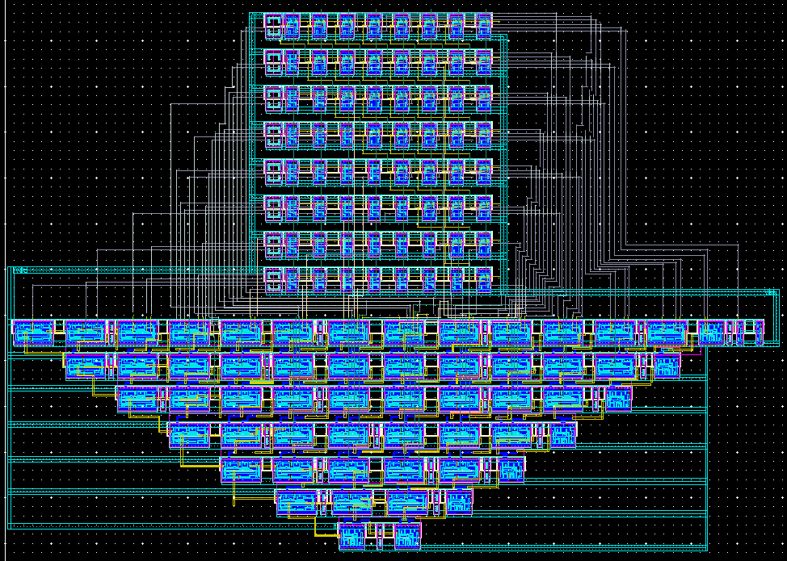
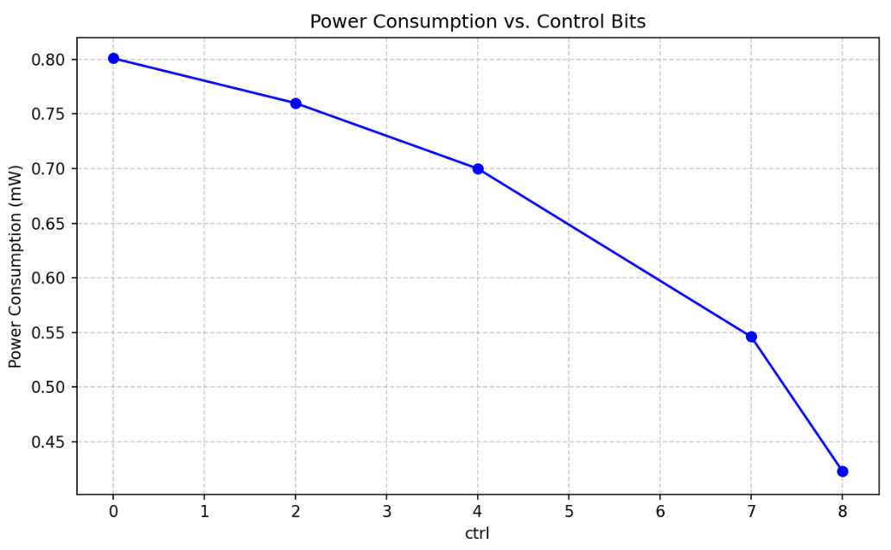
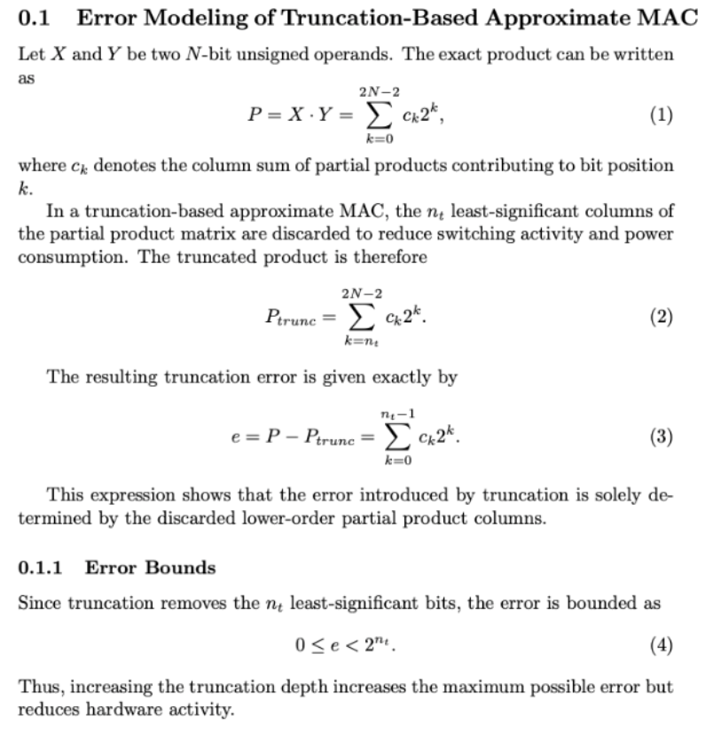
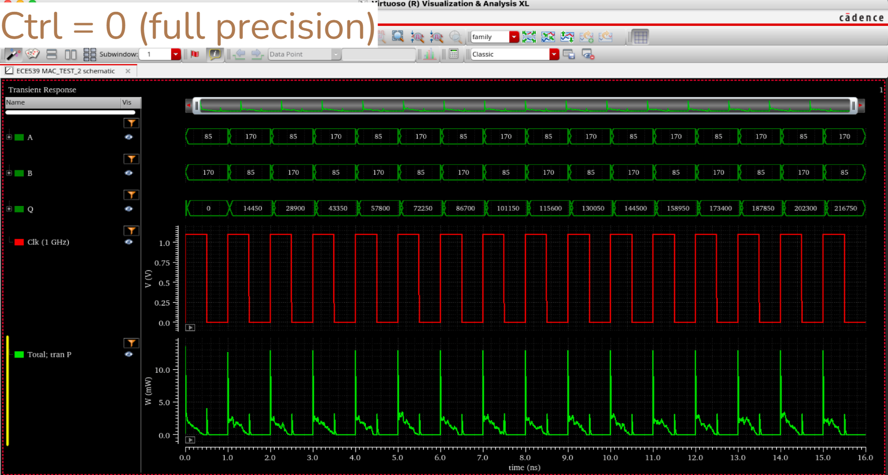

# Low-Power Approximate MAC Unit (65 nm CMOS VLSI)

**Authors:** Devon Knox, Ayush Botke, Humza Chouhdry

## Overview

- This project, which fulfills the Duke ECE senior design requirement, implements a **low-power approximate multiply-and-accumulate (MAC) unit** at the full-custom transistor and layout level.
- The design takes two 8-bit inputs, multiplies them using a **Wallace tree multiplier**, and accumulates the result in a **24-bit register**, effectively computing a dot product.
- Power efficiency is achieved through **controllable approximation**: lower-significance partial product columns in the Wallace tree can be gated off, trading numerical accuracy for reduced power.

---

## Architecture

**Main components:**
- **Wallace Tree Multiplier**
  - The full 8×8 Wallace tree incorporates 4×4 Wallace tree building blocks
  - Partial product truncation via power gating
- **Carry-Lookahead Adders**
  - 16-bit CLA for multiplication result
  - 24-bit CLA for accumulation
- **Accumulation Register**
  - Stores running MAC output
- **Control Logic**
  - 3-bit control input decoded with a thermometer decoder
  - Drives power gating for approximation levels

---

## I/O

**Inputs**
- Clock, Reset  
- 8-bit input `A`  
- 8-bit input `B`  
- 3-bit approximation control  

**Outputs**
- 24-bit accumulated result  

**Total Pins:** 47 (23 inputs, 24 outputs)

---

## Specifications

| Parameter | Value |
|---------|------|
| Supply Voltage | 1.1 V |
| Target Frequency | 500 MHz |
| Verified Frequency | Up to 1 GHz |
| Area | 15,648 µm² |
| Power (Full Precision) | 0.774 mW |
| Power (Low Power / Approximation Mode) | 0.423 mW |

---

## Power vs. Accuracy

Approximation is controlled by truncating partial product columns in the Wallace tree.

Examples:
- **Truncate 4 columns:**  
  0.700 mW, 0.125% error
- **Truncate 8 columns:**  
  0.423 mW, 4.33% error

The following graph displays how power consumption decreases as more control bits from the input are turned on:

Here, we derive the truncation error in the approximate MAC by comparing the exact product to the truncated product, establishing an upper bound on the error:

---

## Timing & Verification

- Functionally verified across all control modes
- Stress-tested up to **1 GHz**
- Worst-case delays:
  - Wallace Tree: 0.38 ns
  - 24-bit CLA: 0.28 ns
- Total critical path: **0.67 ns**
- Waveforms for example input vectors A and B, clocked at 1 GHz (full precision). Accumulated output shown in Q, followed by clock signal and power:

---

## Addtional Notes
- While this project optimized for low power, more advanced routing techniques could give way to significantly lower area.
- I'd consider this the most rewarding project I've been able to work on while at Duke. Finally being able to do something with no abstractions, only transistors and metal (and lots of vias) was extremely rewarding. That being said, passing design rule checks and layout versus schematic was... tedious to say the least!
- We used TSMC’s 65 nm standard-cell library in Cadence Virtuoso for all design and verification.
- Feel free to reach out at devon.knox@duke.edu for any questions!

